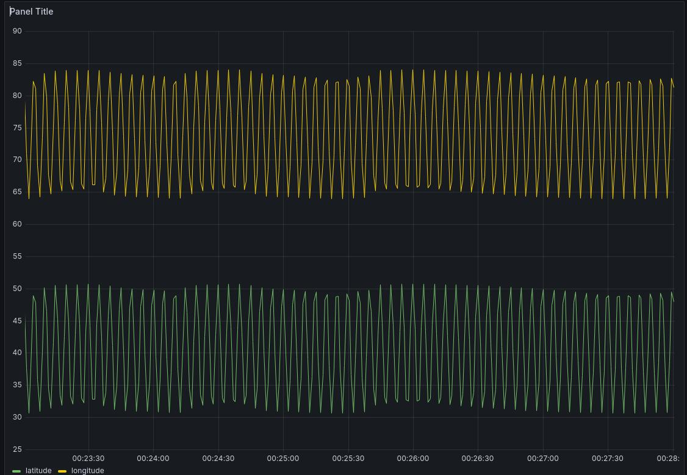

# VTOL

## Dev Log:

03/21: Setup influx db and grafana

Influx DB
https://docs.influxdata.com/influxdb/v2/install/

Grafana:
https://grafana.com/docs/grafana/latest/setup-grafana/installation/debian/

I'm just running these on my laptop for now haha.

03/23: I linked up Grafana to Influx! This is actually really nice.
This will definitely get the job done for development for now. It's just such a fast setup, ~maybe 1 hr to get analyze-able telemetry. And especially with historical analysis to be able to "debug" what went wrong perhaps.

However, my biggest gripe is that honestly with a 5s delay it won't really work for a flight dashboard. I might look into something else for realtime monitoring. Or some sort of "replay from SD card system". Or lastly setting up some sort of dual system. Stream to influxDB + push to grafana live.

For GNC dev, I think I want to be able to make sure the sim can publish to this.

Here's an example of the simple influx db:


Part 2 edit. I found this thread and I adjusted my min refresh interval to 100ms. And not gonna lie my computer is definitely struggling haha, but atleast the data is live. I can totally see how real time telemetry startups are a thing. This does solve my woes for now. I will see how this scales once I go from 2 datapoints to 50x data points at 50hz. I wonder if I have more load from the rendering or from the querying.

03/23:

I think I load-tested Grafana, and I think it will do the job. I will just need to split my realtime dashboard from my analysis dashboard. The realtime dashboard will have a short query window and fetch all datapoints and refresh quickly. The analysis dashboard will fetch data for the entire run, but have aggregation queries.

Optimistically: let's say I am using a 115200 baud rate radio. this means effectively 11520 bytes per second since the 10 to 1 baud to byte conversion.

If I run my FC at 100 HZ, then I can stream 115 bytes per second. This means I can stream 29 floats/integers of critical telemetry. Any more, and I'll have to clock down or pick which telemetry is most important. Or something extremely silly would be to have multiple radio links hahaha. If I clock down to 25Hz, then I can easily buy enough telemetry margin, so I'm sure 115200 baud 915 mhz telem radios will be fine.

03/24:

I'm running into a problem of trying to stream protobuf from the microcontroller. It's definitely very easy to stream from a native process over UDP to another process over UDP, but if I have to send over a radio, it's not as easy since the teensy doesn't really have a socket to write to haha. It only has a radio link. This is where people have implmemented and used: https://mavlink.io/en/.

I am currently trading if I want to use protobuf or if I want to use mavlink. If I wanted to use protobuf, maybe I would just stream serial to an offchip esp32, and then have the esp32 serve the data link.

#03/28

I'm so stuck on build systems.
I may write my own influx library:

ERROR: /home/shihao/.cache/bazel/_bazel_shihao/3d034d55fc3ce2bf9d3f6db42f14f76c/external/libinflux_cxx/BUILD.bazel:10:6: Error while validating output TreeArtifact File:[[<execution_root>]bazel-out/k8-fastbuild/bin]external/libinflux_cxx/libinflux_cxx/include : Child Transport.h of tree artifact /home/shihao/.cache/bazel/_bazel_shihao/3d034d55fc3ce2bf9d3f6db42f14f76c/execroot/_main/bazel-out/k8-fastbuild/bin/external/libinflux_cxx/libinflux_cxx/include is a dangling symbolic link
ERROR: /home/shihao/.cache/bazel/_bazel_shihao/3d034d55fc3ce2bf9d3f6db42f14f76c/external/libinflux_cxx/BUILD.bazel:10:6: Foreign Cc - CMake: Building libinflux_cxx failed: not all outputs were created or valid
Target //:cpp_influx_writer failed to build
Use --verbose_failures to see the command lines of failed build steps.
ERROR: /home/shihao/Code/vvtol/BUILD.bazel:40:10 Linking cpp_influx_writer failed: not all outputs were created or valid
INFO: Elapsed time: 37.002s, Critical Path: 18.30s
INFO: 11 processes: 9 internal, 2 linux-sandbox.
ERROR: Build did NOT complete successfully

no idea what this is about.

# 03/29:

C++ influx writing is a dead end i realize its just a simple HTTP post but I dont want to fight that battle.

So for now, I return to python pymavlink.

After moving the .xml into the right folder, here's how I generate the file.

The prereq is to move the sfr_mavlink.xml in the include folder into the venv dialects/v20 folder.

```
python3 venv/bin/mavgen.py --lang=Python3 --wire-protocol=2.0 --output=venv/lib/python3.8/site-packages/pymavlink/dialects/v20/sfr_mavlink.py venv/lib/python3.8/site-packages/pymavlink/dialects/v20/sfr_mavlink.xml
```

C++ generation:
```
python3 venv/bin/mavgen.py --lang=C++11 --wire-protocol=2.0 -o include/mav/mav_gen venv/lib/python3.8/site-packages/pymavlink/dialects/v20/sfr_mavlink.xml
```

Okay I got it to work and it seems "sufficiently" performant. If I need more performance I'll move the ground station to something else, but I doubt I will be blocked on ground station performance.

Lastly, run the writer/reader pair via:
```
bazel run //:mav_pipe_write
```

```
export MAVLINK20=1 && python psrc/scripts/mav_read.py
```

On some future commit I will make the C++ autogenerated via bazel and same with python and uncommit the autogen...

---

Honestly looking at this I'm starting to realize that I really don't want to use mavlink. It's just so much overhead to do so little. If I want crc's I can just wrap protobuf in another layer.

It is unlikely that I will ever use QGroundControl or anything like that so I should just opt for tools that lock me in the least. I don't want do to do this weird thing where I copy files into some outdated folder etc... and not in XML either.

I think I will look into flat buffers or more and just assume that my radio link is stable. Telemetry is non critical anyway.