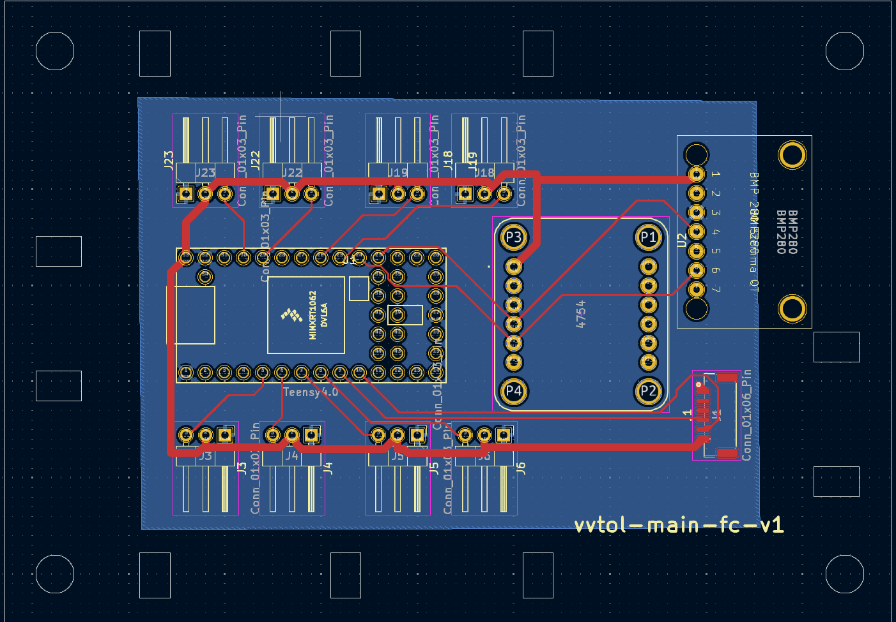
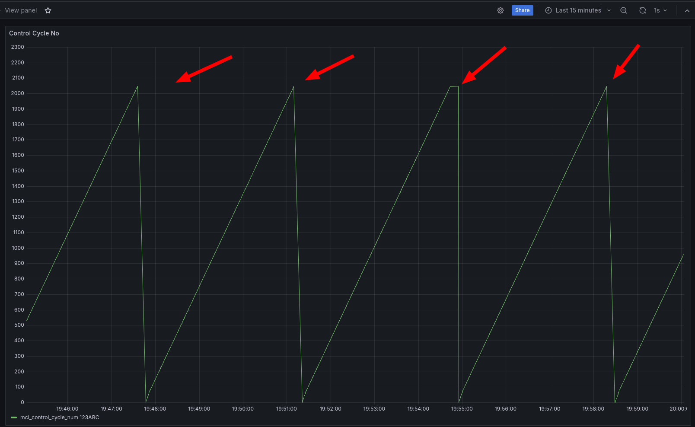

# VTOL

## Hello!


Start the grafana server:
```
sudo systemctl start grafana-server
```

Visit `localhost:9000` to see the grafana data.

In one terminal run:
```
export INFLUXDB..
python psrc/scripts/teensy_influx.py
```

Simultaneously run:
```
pio run -e teensy41 -t upload
```
You may need to do this from a `pio` capable terminal.

## Dev Log:

03/21: Setup influx db and grafana

Influx DB
https://docs.influxdata.com/influxdb/v2/install/

Grafana:
https://grafana.com/docs/grafana/latest/setup-grafana/installation/debian/

I'm just running these on my laptop for now haha.

03/23: I linked up Grafana to Influx! This is actually really nice.
This will definitely get the job done for development for now. It's just such a fast setup, ~maybe 1 hr to get analyze-able telemetry. And especially with historical analysis to be able to "debug" what went wrong perhaps.

However, my biggest gripe is that honestly with a 5s delay it won't really work for a flight dashboard. I might look into something else for realtime monitoring. Or some sort of "replay from SD card system". Or lastly setting up some sort of dual system. Stream to influxDB + push to grafana live.

For GNC dev, I think I want to be able to make sure the sim can publish to this.

Here's an example of the simple influx db:


Part 2 edit. I found this thread and I adjusted my min refresh interval to 100ms. And not gonna lie my computer is definitely struggling haha, but atleast the data is live. I can totally see how real time telemetry startups are a thing. This does solve my woes for now. I will see how this scales once I go from 2 datapoints to 50x data points at 50hz. I wonder if I have more load from the rendering or from the querying.

03/23:

I think I load-tested Grafana, and I think it will do the job. I will just need to split my realtime dashboard from my analysis dashboard. The realtime dashboard will have a short query window and fetch all datapoints and refresh quickly. The analysis dashboard will fetch data for the entire run, but have aggregation queries.

Optimistically: let's say I am using a 115200 baud rate radio. this means effectively 11520 bytes per second since the 10 to 1 baud to byte conversion.

If I run my FC at 100 HZ, then I can stream 115 bytes per second. This means I can stream 29 floats/integers of critical telemetry. Any more, and I'll have to clock down or pick which telemetry is most important. Or something extremely silly would be to have multiple radio links hahaha. If I clock down to 25Hz, then I can easily buy enough telemetry margin, so I'm sure 115200 baud 915 mhz telem radios will be fine.

03/24:

I'm running into a problem of trying to stream protobuf from the microcontroller. It's definitely very easy to stream from a native process over UDP to another process over UDP, but if I have to send over a radio, it's not as easy since the teensy doesn't really have a socket to write to haha. It only has a radio link. This is where people have implmemented and used: https://mavlink.io/en/.

I am currently trading if I want to use protobuf or if I want to use mavlink. If I wanted to use protobuf, maybe I would just stream serial to an offchip esp32, and then have the esp32 serve the data link.

#03/28

I'm so stuck on build systems.
I may write my own influx library:

ERROR: /home/shihao/.cache/bazel/_bazel_shihao/3d034d55fc3ce2bf9d3f6db42f14f76c/external/libinflux_cxx/BUILD.bazel:10:6: Error while validating output TreeArtifact File:[[<execution_root>]bazel-out/k8-fastbuild/bin]external/libinflux_cxx/libinflux_cxx/include : Child Transport.h of tree artifact /home/shihao/.cache/bazel/_bazel_shihao/3d034d55fc3ce2bf9d3f6db42f14f76c/execroot/_main/bazel-out/k8-fastbuild/bin/external/libinflux_cxx/libinflux_cxx/include is a dangling symbolic link
ERROR: /home/shihao/.cache/bazel/_bazel_shihao/3d034d55fc3ce2bf9d3f6db42f14f76c/external/libinflux_cxx/BUILD.bazel:10:6: Foreign Cc - CMake: Building libinflux_cxx failed: not all outputs were created or valid
Target //:cpp_influx_writer failed to build
Use --verbose_failures to see the command lines of failed build steps.
ERROR: /home/shihao/Code/vvtol/BUILD.bazel:40:10 Linking cpp_influx_writer failed: not all outputs were created or valid
INFO: Elapsed time: 37.002s, Critical Path: 18.30s
INFO: 11 processes: 9 internal, 2 linux-sandbox.
ERROR: Build did NOT complete successfully

no idea what this is about.

# 03/29:

C++ influx writing is a dead end i realize its just a simple HTTP post but I dont want to fight that battle.

So for now, I return to python pymavlink.

After moving the .xml into the right folder, here's how I generate the file.

The prereq is to move the sfr_mavlink.xml in the include folder into the venv dialects/v20 folder.

```
python3 venv/bin/mavgen.py --lang=Python3 --wire-protocol=2.0 --output=venv/lib/python3.8/site-packages/pymavlink/dialects/v20/sfr_mavlink.py venv/lib/python3.8/site-packages/pymavlink/dialects/v20/sfr_mavlink.xml
```

C++ generation:
```
python3 venv/bin/mavgen.py --lang=C++11 --wire-protocol=2.0 -o include/mav/mav_gen venv/lib/python3.8/site-packages/pymavlink/dialects/v20/sfr_mavlink.xml
```

Okay I got it to work and it seems "sufficiently" performant. If I need more performance I'll move the ground station to something else, but I doubt I will be blocked on ground station performance.

Lastly, run the writer/reader pair via:
```
bazel run //:mav_pipe_write
```

```
export MAVLINK20=1 && python psrc/scripts/mav_read.py
```

On some future commit I will make the C++ autogenerated via bazel and same with python and uncommit the autogen...

---

Honestly looking at this I'm starting to realize that I really don't want to use mavlink. It's just so much overhead to do so little. If I want crc's I can just wrap protobuf in another layer.

It is unlikely that I will ever use QGroundControl or anything like that so I should just opt for tools that lock me in the least. I don't want do to do this weird thing where I copy files into some outdated folder etc... and not in XML either.

I think I will look into flat buffers or more and just assume that my radio link is stable. Telemetry is non critical anyway.

03/31:

I got airproto, my own version of mavlink using protobuf to work in Desktop, but I think I may need to use nano pb to actually run it on teensy.

https://stackoverflow.com/questions/63842860/using-nanopb-and-protobuf-for-serialisation-deserialisation-together-in-applicat

Here's how to run it:
```
python psrc/scripts/air_proto_reader.py 
```
and in the other:
```
bazel run --compilation_mode=dbg //:air_proto_writer
```

alternatively, you can also run via:
```
bazel run --compilation_mode=dbg //:air_nano_proto_writer
```
this one uses nano pb


## 04/14

Plumbing is going well.

You can run the teensy via

```
pio run -e teensy41 -t upload
```

run the python reader via
```
python psrc/scripts/teensy_air_proto_reader.py
```

## 04/28:
- Added capability to restart from lost link. I think link is sometimes lost due to overcurrent maybe.

- Added capability to use nano pb repeated fields as vectors.
  - The pitfall I ran into was not realizing there was a "has_field" struct member. This needs to be set to true.
  - The other thing I messed up was setting the .decode callback and the .encode callback. I discovered this error because I read the source code and it is a union.

## 05/19:
Now that I have a HITL (SHITL) table, I was running into some issues when not having the debug port active. It was because I still had this inserted:

```
while (!Serial)
{
    ; // Wait for serial port to connect
}
```

But in general, I decided I had a need to clearly communicate whether or not the main loop was making progress, so I wrote a simple BlinkLedTask.cpp to turn off and on the LED to check if the cycles were executing atleast this task every cycle.

### Debug Programs

I made a standalone blink.cpp as well as a servo.cpp that makes it very easy to debug if the hardware is wrong or if the software is wrong because you're flashing very simple software that should definitely work. If it doesn't then you have a HW problem. If you have a SW problem, then the simple program would work but not the complex version.

### Wiring

Funny because I immediately ran into a problem where I thought I had the wiring right but I was reading the labels wrong. The debug program helped lots.

Always use the wiring diagram, not the tiny numbers on the PCB...

### Adding a new field to the telemetry stack
Well I'll start by getting it to compile inside HOOTL again. I want to do this to make it easier to build and test things.

```
pio run -e dev
```
To build HOOTL

If you add new statefields, you can use `./scripts/pb_build.sh` to refresh your nanopb files after you have updated the proto.

I also added: `scripts/run_dev.sh` which will compile the HOOTL build, and start running it in your terminal. Next time I need to get the telemetry piped to the fifo, and run from there.

## 05/21
It's getting a bit hard to remember how to launch things so I added a `launch_hootl.sh` script. Eventually I should replace this with a pytest. This should be enough to boot the essentials and start testing.


## 06/16
I think it's finally time that I start doing more hardware.
I took a stab at pcb design.

I decided to use KiCAD.

In order to have schematics and footprints for my components I decided to use:
https://github.com/XenGi/teensy.pretty
https://github.com/XenGi/teensy_library

I had a fumble where  I didn't really understand how to transfer schematics to the footprint files. The unblocker was realizing I can sync through exporting netlist and then reingesting that, but I bet there's another way.

Watched this video to learn how to create a symbol
https://www.youtube.com/watch?v=_H1MZLR-UZM

So far I have some of the design:


## 06/23

Today I learned how to use free routing, as well as make my own footprint for the BMP280 Stemma QT version (since it didn't exist).

Still todo are: Set PCB Manufacturing settings, and maybe re-route things myself.


## 07/0?

I finished my PCB! I had some friends give me some good advice about how to design PCBs.

Autoroute was not good enough by default. The biggest change I made was to move all the grounds to a ground
plane on the back side. I initially didn't think I would be able to route all the signal and power on the front side, but I was able to after enough creative thinking. I also made sure to make the PCB traces thicker for power. Lastly, I cut holes around the outside of the PCB design to act as tie down points. Not quite sure how I will mount this to the drone yet, but I am sure it will help. I am very proud of this design, even if it is only the first version.



## 07/14

Today I spent a good amount of time running through 3b1b's + Ben Eater's quaternion interactive videos.
I think I am still working on the full intuition on, what happens to everything everywhere when you multiply by some arbitrary quaternion.

But I really do start to see the two perpendicular circles rotating in sync, and I'm starting to see how "most" of the time you want a quat with 1 magnitude in order to represent a 3d rotation.


## 07/27

Today I really want to get started on doing some GNC stuff for real. I think the core things I need to make this happen are: Automatic Grafana plumbing so I can see everything real time, and play around with the data. To do this, I will commit a sin and use code gen, but I think this is fine. I am combatting the complexity by moving all the "meat" of the code gen to `sfr_gen.py`.

I want `sfr_gen.py` because I am tired of adding one state field and having to update a million files.

Secondly I don't have any hardware on me so I might as well build out my HOOTL for real. To do this I am adding a `simulator_injector` task. I plan to inject state here as well as propagate state.

## 07/28

I put in an initial control loop, and it targets the target coordinates "ok", I spoke with Govind, and I think my first initial target should be a set of cascading PID control loops. I think I want to do Pos Error -> Attitude Error -> Attitude Rate Error as my cascading loop.

Here you can see a photo of my initial control loops in action:


Next I am trying to work on visualizing my orientation in real time, I think python three.js via Jupyter notebook is the move.

## 08/11

Working on my project on the plane right now, but it looks like I deleted my venv at a certain point, and re-pip installed into a new venv, but it looks like my `pb_build.sh` script requires a python nanopb package, which I don't have installed since I didn't update my requirements.txt so then when I re pip installed I didn't get nanopb. Sad.

## 08/25

I learned a bit of threejs and created this render:


I initiall tried writing things in python (jupyternotebook) but very quickly realized that without it being data driven from the grafana, it would be substantially less useful. Also, you can't render text in pythonthreejs, so that sucks.

ThreeJS seems really powerful and very easy to get started with, the difficult part will now be to get it hooked into a grafana plugin. That is proving a bit difficult.

https://grafana.com/developers/plugin-tools/

## 08/30

I got it to run inside grafana! It really wasn't that bad, just had to start from the example, and just add things one by one.


Now the challenge will be to pull real data.

## 09/01

Wow that was probably one of the most frustrating debugging experiences ever. Grafana doesn't seem to reload your plugin even when you copy the files locally unless you update the `package.json` version number. The worst part is that it would _sometimes_ work without updating it. I think this happened whenever I rebooted my computer, thus clearing some plugin cache somewhere. The two hardest things in programming truly are caching and variable naming.

You can see the evidence of this pain in `scripts/install-panel.sh`.

---

I got the data plumbed! I have done the "clearing the old polygons part yet".


## 09/14

Today I soldered together my board that I got from JLCPCB, and put the MVP level of components on it. This is actually my second board I tried soldering, the first time I soldered things together, when I powered on, the teensy just got really hot so I must have soldered a short somewhere. I was too lazy to find it, so I just made another one. This time though I am methodically testing things after every thing a solder to make sure I rule out all the previous solder jobs as "not the problem" if things break.

I needed the Teensy so that I have a computer to talk to, and the IMU so that I can have a real time data source to make sure the data logging looks good and low latency, and then a radio so that I can reserve the hardline serial for debug output, and keep the radio as just telemetry.


So I've been running things for a while now, but I'm not super happy with how slow things are. I'm taking two steps to address this temporarily.

I've got a lot of telemetry bloat, so I'm turning channels off that I don't need. And secondly, I think I am going to try and clean out my
influxdb, I wonder if things have gotten slow because a lot of old data has piled up. `influxd` is eating up so much of my performance locally.

Okay I changed shard group retention to be shorter:
`influx bucket update -i 11caa83bfa0edd33 --shard-group-duration 1h0m0s`

I also had to do:
`influx config create --config-name vvtol-config --host-url http://localhost:8086 --org vvtol --token foobar`

from docs:
`https://docs.influxdata.com/influxdb/v2/tools/influx-cli/#authenticate-with-a-username-and-password`


I also made sure to restart influxd via `sudo systemctl restart influxd`.

WOW. Together that really made a huge difference. 100% cpu utilization downto 80%. And now it looks like my Grafana dashboard doesn't lag anymore.

Even when re-enabling a bunch of unused channels, I still have overhead available. That said, when CPU Usage does go up though, thats when my grafana query time seems to suffer.

---

Other things I changed to get better performance out of my telemetry stack. I had a bunch of sleeps under error conditions in python, I dropped those down to `0.001s` so that they aren't issues. Secondly, this keeps biting me in the butt, but don't run hardware things in the god damn vscode terminal. Something about it makes it so that it has an unreliable connection to the serial port? Maybe this is something to do with `syscall`s, or `platformio` meddling, but the performance and reliability of `teensy_influx.py` shot through the roof when I was running teensy influx in my terminal.

But probably most hilariously I had a sleep statement that would only pull in new data every `0.1s` This made it so that as soon as I went above `10hz` all my data started lagging very quickly.

Anyway, things are faster and there is no lag.

I would recommend not refreshing any faster than `1s` in Grafana, and make sure to always run things in a normal terminal!

Also here's a link to add more refresh rates in Grafana: `https://community.grafana.com/t/how-to-change-refresh-rate-from-5s-to-1s/39008/3`

Lol my code keeps crashing around CCNO 2000... surely I must have left some suspicious code somewhere that just landmines...



## 10/20

Today and yesterday I cadded some fins, added them, and got them to move slightly in response to angle error.


